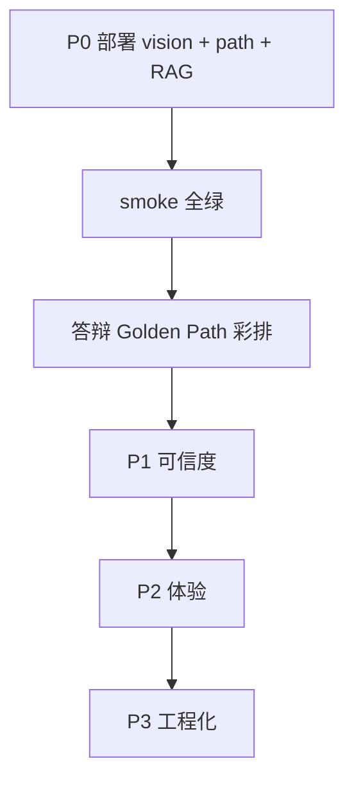

# 智屿第二轮改进 Backlog

基于 [`FUNCTIONAL_TEST_REPORT.md`](./FUNCTIONAL_TEST_REPORT.md) 与全功能冒烟结果整理。  
**P0 多模态修复已在本地代码完成，首要动作是部署到验收服务器并复测。**

---

## P0 — 第三轮已完成 / 待部署验证

| ID | 任务 | 状态 |
|----|------|------|
| P0-RAG | `vector_store` 兼容无 `persist()` 的 langchain-chroma | 代码已修 |
| P0-LINK | `Student.user_id` + `student_link_service` | 代码已修 |
| P0-SEED | `scripts/seed_competition_demo.py` | 已新增 |

## P1 — 第三轮体验（本轮）

| ID | 任务 | 状态 |
|----|------|------|
| P1-CHAT | 学生 `/tutor` 独立 AI 伴学 + DeepSeek 式 UI | 已完成 |
| P1-PHASE | SSE `phase` 事件 + `AgentCollaborationTimeline` | 已完成 |
| P1-TEACHER | 教师 `/profile/class-insights` | 已完成 |
| P1-VISUAL | `ZyMediaHero` + 伴学大厅/课程总览视觉 | 已完成 |

## P0 — 阻塞答辩 / Demo（历史）

| ID | 任务 | 负责模块 | 验收标准 |
|----|------|----------|----------|
| P0-1 | **部署 vision 修复到服务器** | backend | `vision_probe.probe_ok=true`；伴学上传图片能描述内容 |
| P0-2 | **同步 learning_path API** | backend | `GET /learning-path/me` 非 404 |
| P0-3 | **修复 RAG 上传 500** | backend + ops | 检查 `OLLAMA_EMBEDDINGS_MODEL`、`CHROMA_DB_PATH`；smoke `rag_upload` pass |
| P0-4 | 部署后跑完整 smoke | QA | `smoke_report_post_deploy.json` 无 fail（multimodal 必 pass） |

---

## P1 — 赛题可信度（1–2 天）

| ID | 任务 | 文件/位置 | 说明 |
|----|------|-----------|------|
| P1-1 | 学情 LLM 超时 8s → 25s | `learning_report_service.py` | 减少静默模板 fallback |
| P1-2 | 资源工坊标注 `generation_mode` | `resource_workshop.py` + 前端 | UI 显示 template / llm |
| P1-3 | 教师工作台演示数据徽章 | `views/dashboard/workplace/` + `api/dashboard.ts` | API 失败时显示「演示数据」 |
| P1-4 | 学情诊断 `possibly_template` 可观测 | learning-report 响应字段 | 增加 `source: llm|template` |
| P1-5 | 伴学多模态降级 UI 提示 | `LegacyAssistantPanel.vue` | vision error/ocr 时提示用户 |

---

## P2 — 体验与完整性（2–3 天）

| ID | 任务 | 说明 |
|----|------|------|
| P2-1 | 数字人「形象克隆」接 API 或改「即将上线」 | 当前 `setTimeout` 模拟 |
| P2-2 | 课堂监控摄像头列表改 ENV/DB | 去除硬编码内网 IP |
| P2-3 | 隐藏 Arco 模板路由 | `/list/*`、`/form/*` 移出菜单 |
| P2-4 | 资源工坊 packages LLM 增强成功率 | 优化 prompt / 超时 / fallback 文案 |
| P2-5 | 行为分析记录持久化 | 当前内存 `analysis_records` 重启丢失 |

---

## P3 — 工程化（持续）

| ID | 任务 | 说明 |
|----|------|------|
| P3-1 | smoke 接入 CI | 依赖不可用则 skip，multimodal 必断言 |
| P3-2 | Playwright P0 Golden Path | 登录 / 图片对话 / 学情 / 资源工坊 |
| P3-3 | 讯飞 | 维持架构预留 + 文档，不阻塞 |
| P3-4 | `docs/COMPETITION_COMPLIANCE.md` 同步 | 引用本报告与 smoke 脚本 |

---

## 建议迭代顺序



---

## 运行冒烟脚本

```bash
cd code/backend
pip install httpx pytest   # 若未安装
PYTHONPATH=. python3 scripts/smoke_functional_test.py \
  --base-url http://127.0.0.1:18001 \
  --email your@email.com \
  --password 'your-password' \
  --output ../../docs/smoke_report.json
```

单元测试（vision 解析，无需后端）：

```bash
PYTHONPATH=. python3 -m pytest tests/services/test_vision_response.py -q
```
