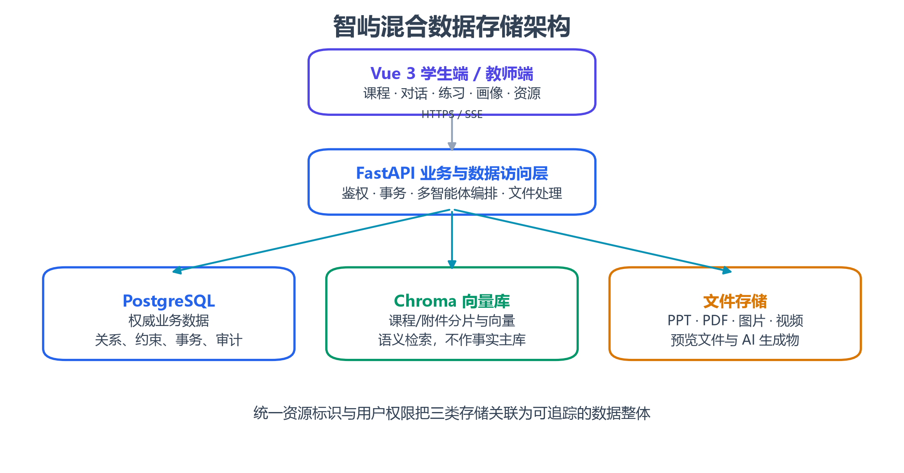
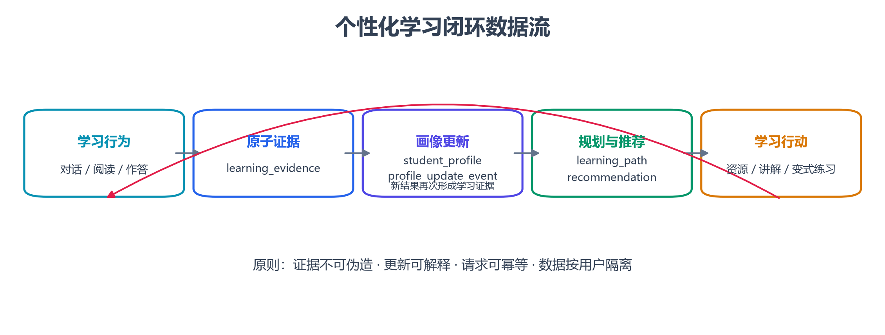
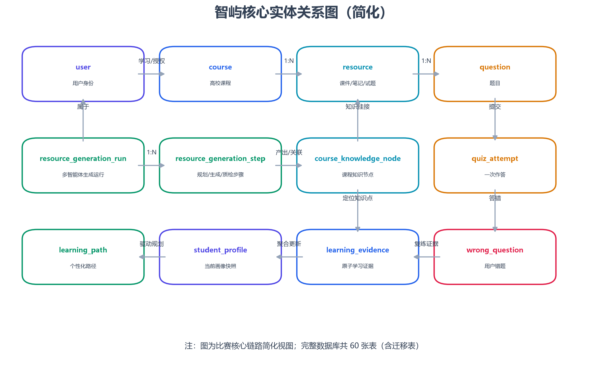

# 智屿智能教育平台

## 数据库设计说明书

**文档编号：** ZHIYU-DBDD-001  
**版本：** V1.0  
**编制日期：** 2026 年 7 月 20 日  
**参赛赛题：** A3—基于大模型的个性化资源生成与学习多智能体系统开发  
**参赛团队：** ____________________  
**项目负责人：** __________________  
**指导教师：** ____________________

> 本文依据用户提供的《数据库设计说明书编写规范》，结合中国软件杯 A3 赛题要求及智屿项目当前数据库、迁移脚本和业务模型编制。

---

## 文档修订记录

| 版本 | 日期 | 修订人 | 修订内容 |
|---|---|---|---|
| V1.0 | 2026-07-20 | 项目组 | 形成参赛提交版，覆盖课程知识库、学习证据、学生画像、资源生成和多智能体运行数据 |

## 目录

1. 引言  
2. 设计依据与目标  
3. 数据库总体设计  
4. 概念结构设计  
5. 逻辑结构设计  
6. 物理结构设计  
7. 数据完整性设计  
8. 安全与隐私设计  
9. 备份、恢复与运维  
10. 赛题要求映射与验收  
附录 A 数据表总览  
附录 B 命名与状态约定

---

# 1 引言

## 1.1 编写目的

本文说明智屿智能教育平台数据库的设计思想、数据分域、实体关系、表结构、约束、索引、安全策略与运维方法，为系统开发、测试、部署、比赛评审和后续维护提供统一的数据基线。

## 1.2 项目背景

智屿面向高校个性化学习场景，以大模型、多模态、知识库和多智能体技术为基础，形成“课程资源—学习行为—智能诊断—画像更新—学习规划—资源/练习反馈”的闭环。数据库不仅保存传统用户和课程数据，还需要保存课程知识关系、AI 运行过程、学习证据、画像版本及个性化推荐依据，使系统的智能决策可追踪、可解释、可恢复。

## 1.3 设计范围

本文覆盖以下数据：

- 用户、院系、教师、学生、课程、教学班和教学计划；
- 软件工程导论课件、笔记、试题、PPT 及外部学习资源；
- 对话线程、消息、附件生成物、引用与模型调用指标；
- 题目、测验作答、错题、变式练习与练习记录；
- 学习证据、学生画像、画像更新事件和学习路径；
- 课程知识图谱、知识节点动作和资源—知识点关联；
- 多智能体任务、资源生成运行、步骤、质量信息与错误状态；
- 通知、积分、成就及可选的课堂行为分析数据。

课程原始文件、预览文件和生成物本体采用文件存储；课程分片与语义向量采用 Chroma；PostgreSQL 保存权威业务数据和可追踪关系。

## 1.4 术语与缩写

| 术语 | 说明 |
|---|---|
| PostgreSQL | 平台主要关系型数据库管理系统 |
| SQLModel | 结合 Pydantic 与 SQLAlchemy 的 Python 数据模型框架 |
| Alembic | 数据库版本迁移工具 |
| RAG | 检索增强生成，利用课程或上传文档证据辅助模型回答 |
| 学习证据 | 可支持画像判断的作答、对话、阅读或任务事件 |
| 物化画像 | 从多条学习证据聚合形成的当前学生画像快照 |
| 生成运行 | 一次资源生成工作流的完整执行记录 |
| JSON | 用于保存结构可演进但仍受服务层 Schema 约束的数据字段 |

## 1.5 参考资料

1. 用户提供的《数据库设计说明书编写规范》。
2. 第十五届“中国软件杯”大学生软件设计大赛 A3 赛题页面：https://www.cnsoftbei.com/content-3-1286-1.html 。
3. 智屿项目 SQLModel/SQLAlchemy 模型与 Alembic 迁移脚本。
4. 《智屿智能教育平台软件需求规格说明书》V1.0。

# 2 设计依据与目标

## 2.1 软件杯赛题要求

本届公开赛题列表将 A3 标明为“基于大模型的个性化资源生成与学习多智能体系统开发”。结合赛题页面与项目任务要求，数据库需直接支撑：

1. 参赛团队自行构造至少一门完整高校专业课程的初始知识库/文档集；
2. 依据学生特征和学习过程进行动态画像与个性化资源生成；
3. 支持文本、图像、文档、PPT 等多模态学习资源；
4. 支持多个学习智能体协同工作，并能展示其任务过程与结果；
5. 形成从学习行为到诊断、规划、练习和再评价的闭环；
6. 保障学习数据、用户隐私、模型调用和生成内容的可追溯性。

## 2.2 数据库设计目标

- **一致性：** 用户、课程、资源、题目和画像之间具有明确关系，关键业务使用主外键、唯一约束和事务保证一致性。
- **可追踪：** AI 任务记录运行、步骤、模型、输入输出摘要、引用、错误和耗时；画像结论可回溯到学习证据。
- **可演进：** 稳定身份和关系采用规范化表结构，快速演进的画像维度、智能体共享状态等采用受控 JSON 字段。
- **可解释：** 推荐保存推荐理由和证据，画像更新保存前后状态，课程回答保存引用与路由信息。
- **可恢复：** 长任务保存状态、尝试编号、租约和幂等键，服务中断后可判断继续、取消或重试。
- **安全：** 敏感字段不进入前端公开模型，学习数据按用户隔离，密钥不进入数据库业务表。

## 2.3 当前数据库基线

截至 2026 年 7 月 20 日，项目使用 PostgreSQL，Alembic 当前版本为 `027 (head)`。实际数据库包含 60 张表，其中 `alembic_version` 为迁移控制表，其余为业务、运行和支撑表。系统采用 UUID 作为多数领域实体的主键；对话和运行时兼容模块中保留整数或字符串主键。

# 3 数据库总体设计

## 3.1 数据存储架构

系统使用三类存储，各自承担不同职责：

| 存储 | 保存内容 | 设计理由 |
|---|---|---|
| PostgreSQL | 用户、课程、资源元数据、题目、作答、证据、画像、任务状态、引用与审计 | 需要事务、一致性、权限边界和复杂关联查询 |
| Chroma 向量库 | 课程与上传文档的文本分片、向量、检索元数据 | 支持语义检索和 RAG，不作为权威业务事实源 |
| 文件存储 | PPT/PDF/图片/视频、预览文件、生成物 | 避免大文件占用关系库；数据库仅保存受控路径和元数据 |

## 3.2 数据分域

| 数据域 | 代表实体 | 主要职责 |
|---|---|---|
| 身份与教学组织域 | `user`、`ud`、`teacher`、`student`、`course`、`tc` | 用户身份、院系、课程和教学班关系 |
| 课程资源域 | `resource`、`external_resource`、`generated_resource_package` | 统一描述本地资料、外部资料与 AI 生成资源 |
| 对话与智能体域 | `chatthread`、`chat`、`chatartifact`、`agent_task`、`aiusagelog` | 保存学习会话、智能体路由、引用和运行指标 |
| 测验与错题域 | `question`、`quiz_attempt`、`wrong_question`、`practice_record` | 作答、评分、错题归档和针对性练习 |
| 证据与画像域 | `learning_evidence`、`student_profile`、`profile_update_event` | 从原子证据形成可解释的画像快照 |
| 学习规划域 | `learning_path`、`learning_task`、`student_notification` | 保存个性化路径、当前任务与提醒 |
| 知识网络域 | `course_knowledge_node`、`course_knowledge_edge`、`resource_knowledge_link` | 表达课程知识结构及资源关联 |
| 生成工作流域 | `resource_generation_run`、`resource_generation_step` | 记录多智能体资源生成任务的过程与状态 |
| 教学分析域 | `behaviorsummaryrecord`、`courseengagementrecord`、`studentbehavioralert` | 保存可选课堂行为分析的聚合数据与告警 |

## 3.3 数据流

学习行为首先形成不可混用的用户级记录；证据服务将有效事件以幂等方式写入 `learning_evidence`；画像服务读取增量证据，更新 `student_profile` 并写入 `profile_update_event`；规划和推荐服务依据画像生成 `learning_path` 与 `personalized_resource_recommendation`；学生完成新任务或练习后再次形成证据，从而构成闭环。

## 3.4 事务边界

- 测验提交、错题新增/累计和学习证据写入应在一个业务事务内完成，或使用幂等事件保证最终一致。
- 资源生成运行与步骤状态分开提交，以便长任务失败时保留已完成阶段。
- 画像更新应先读取确定的证据集合，再原子更新画像快照并写入前后状态事件。
- 文件写入采用“临时文件—校验—元数据提交—正式文件”流程，避免数据库存在指向半成品的记录。

# 4 概念结构设计

## 4.1 核心实体关系图

图中突出与 A3 赛题核心能力直接相关的关系：用户通过课程和教学班参与学习；课程拥有资源、题目和知识图谱；作答形成错题与证据；证据驱动画像、学习路径和推荐；多智能体资源生成以运行和步骤表记录全过程，并把生成资源重新关联到课程知识节点。

## 4.2 主要关系说明

| 关系 | 基数 | 说明 |
|---|---|---|
| 院系—课程 | 1:N | 一个院系可建设多门课程 |
| 课程—教学班 | 1:N | 同一课程可由不同教师开设多个教学班 |
| 学生—教学班 | M:N | 通过 `studenttc` 建立选课关系 |
| 课程—资源 | 1:N | 资源可为原始资料、试题载体或生成物 |
| 资源—题目 | 1:N | 一个测验资源包含多道题目 |
| 用户—测验作答 | 1:N | 每次提交保存一条作答记录 |
| 用户—错题 | 1:N | 同一道题对同一用户只保留一条累计错题记录 |
| 用户—学习证据 | 1:N | 每个学习事件形成带来源和置信信息的证据 |
| 用户—学生画像 | 1:1 | `user_id` 唯一，保存当前物化画像 |
| 用户—学习路径 | 1:1 | 当前版本按用户保存一条活动路径 |
| 课程—知识节点 | 1:N | 节点在课程和图谱类型范围内唯一 |
| 知识节点—知识边 | N:M | 边分别引用源节点和目标节点 |
| 生成运行—步骤 | 1:N | 每次运行含规划、生成、质检、持久化等步骤 |

## 4.3 规范化与反规范化

核心身份、课程、资源、题目、作答及知识关系满足关系模型规范化要求，避免重复保存主体信息。以下字段出于性能、版本化或模型输出演进需要使用 JSON：

- `student_profile.dimension_scores`：八维画像当前分值；
- `student_profile.knowledge_state`：知识点掌握聚合状态；
- `learning_evidence.payload`：不同证据类型的扩展信息；
- `resource_generation_run.shared_state`：多智能体共享运行状态；
- `resource_generation_step.citations`：该步骤使用的证据列表；
- `learning_path.nodes`：有序、可扩展的路径节点快照。

JSON 字段仍须通过 Pydantic/SQLModel Schema 校验，不能存放任意无结构内容。需要高频过滤、唯一性或跨实体关联的属性必须提升为普通列或独立表。

# 5 逻辑结构设计

## 5.1 身份与教学组织域

### 5.1.1 `user` 用户表

| 字段 | 类型 | 约束 | 说明 |
|---|---|---|---|
| `id` | UUID | PK | 用户唯一标识 |
| `email` | VARCHAR | UNIQUE, INDEX, NOT NULL | 登录邮箱 |
| `username` | VARCHAR | INDEX, NOT NULL | 显示名称 |
| `hashed_password` | VARCHAR | NOT NULL | 密码安全哈希，不保存明文 |
| `is_active` | BOOLEAN | DEFAULT TRUE | 是否可用 |
| `is_superuser` | BOOLEAN | DEFAULT FALSE | 是否管理员 |
| `created_at` | TIMESTAMP | NOT NULL | 创建时间 |

### 5.1.2 教学组织表

| 表 | 主键 | 关键外键 | 主要字段与用途 |
|---|---|---|---|
| `ud` | `id` UUID | — | 大学、院系、创建/更新时间 |
| `teacher` | `id` UUID | `ud_id → ud.id` | 教师姓名、工号/标识 |
| `course` | `id` UUID | `ud_id → ud.id` | 课程名称、简介、类型、课程标识、点击量 |
| `tc` | `id` UUID | `course_id → course.id`；`lecturer_id → teacher.id` | 教学班名称及授课关系 |
| `student` | `id` UUID | `ud_id → ud.id`；`user_id → user.id` | 学生姓名、学号及账号映射 |
| `studenttc` | `id` UUID | `student_id → student.id`；`tc_id → tc.id` | 学生与教学班多对多关系 |
| `courseplan` | `id` UUID | `tc_id → tc.id` | 周次、目标和重点 |

**设计说明：** `user` 表负责认证身份，`student`/`teacher` 表负责教育业务身份。二者分离可避免将所有教育属性塞入认证表，并支持管理员或教师等不同角色扩展。

## 5.2 课程资源与知识库域

### 5.2.1 `resource` 课程资源表

| 字段 | 类型 | 约束 | 说明 |
|---|---|---|---|
| `id` | UUID | PK | 资源标识 |
| `title` | VARCHAR(255) | NOT NULL | 资源标题 |
| `type` | VARCHAR(50) | NOT NULL | pdf、ppt、pptx、doc、quiz、external_video 等 |
| `subject` | VARCHAR(80) | INDEX | 学科，支持错题/资源按课程分类 |
| `file_name` | VARCHAR(255) | — | 原始文件名 |
| `file_path` | VARCHAR(255) | 服务端私有 | 文件存储相对路径，公开响应不返回 |
| `file_size` | INTEGER | DEFAULT 0 | 文件字节数 |
| `content_type` | VARCHAR(150) | — | MIME 类型 |
| `course_id` | UUID | FK → `course.id` | 所属课程 |
| `package_id` | VARCHAR(64) | FK → `generated_resource_package.id` | 来源生成包 |
| `content` | JSON | 可空 | 结构化题目、图谱或预览数据 |
| `url` | VARCHAR(500) | 可空 | 外部或可访问地址 |
| `knowledge_point` | VARCHAR(160) | INDEX | 知识点 |
| `difficulty` | VARCHAR(32) | INDEX | 难度 |
| `source` | VARCHAR(80) | INDEX | 原始、生成或其他来源 |
| `uploader_id` | UUID | FK → `user.id` | 上传者 |
| `upload_time` | TIMESTAMP | NOT NULL | 上传时间 |

### 5.2.2 `external_resource` 外部资源表

保存公开网络资源的规范化元数据，包括标题、来源平台、唯一 URL、资源类型、学科、知识点、难度、推荐原因、提供方、摘要、作者、发布年份、语言、许可状态、封面、发现时间与核验时间。系统只保存有界元数据，不抓取或复制平台的任意全文。

### 5.2.3 软件工程导论数据

“软件工程导论”作为赛题要求的完整高校专业课程输入，当前资源基线为 114 条：82 条 PPT、13 条笔记、13 条练习、3 条哔哩哔哩视频、2 条小红书公开笔记入口及 1 条既有题目资源。资源本体位于文件存储，`course` 和 `resource` 保存课程关系、类型、知识点与访问元数据，支持 PPT 放映、知识库索引和个性化推荐。

### 5.2.4 向量索引映射

Chroma 保存从课程文件或用户上传文档中提取的分片。每个向量条目至少携带 `course_id`、`resource_id`/文件标识、分片序号、来源名称和文本范围。PostgreSQL 是资源存在性和权限的权威来源；删除资源后，应同步删除或重建对应向量索引。

## 5.3 对话与智能体域

| 表 | 关键字段 | 说明 |
|---|---|---|
| `chatthread` | `thread_id` UNIQUE、`user_id`、`course`、`knowledge_point`、`intent`、`session_status`、`session_metadata` | 学习会话及课程上下文 |
| `chat` | `thread_id`、`user_input`、`system_prompt`、`response`、`created_at` | 一轮用户输入与 AI 响应 |
| `chatartifact` | `chat_id` UNIQUE、`agent`、`intent`、`routing_reason`、`citations_json`、`suggestions_json` | 回答的智能体路由、引用和建议 |
| `agent_task` | `session_id`、`run_id`、`task_key`、`agent_name`、`status`、`progress` | 用户可见的智能体执行状态 |
| `aiusagelog` | `provider`、`model`、`status`、`ttft_ms`、`latency_ms`、Token 数、工具调用数 | 模型可观测性和用量分析 |

`agent_task` 对 `(run_id, task_key)` 设置唯一约束，避免一次运行中重复创建同名任务。`chatartifact.chat_id` 唯一，使每轮回答只有一份当前结构化产物记录。

## 5.4 题库、作答与错题域

### 5.4.1 `question` 题目表

| 字段 | 类型 | 约束 | 说明 |
|---|---|---|---|
| `id` | UUID | PK | 题目标识 |
| `resource_id` | UUID | FK → `resource.id`, INDEX | 所属测验资源 |
| `knowledge_point` | VARCHAR(160) | INDEX | 自动学科分类与画像聚合依据 |
| `question_type` | VARCHAR(32) | — | single_choice 等 |
| `content` | VARCHAR(2000) | NOT NULL | 题干 |
| `options` | JSON | NOT NULL | 选项列表 |
| `answer` | VARCHAR(500) | NOT NULL | 标准答案，仅提交后按权限返回 |
| `analysis` | VARCHAR(3000) | — | 解析 |
| `difficulty` | VARCHAR(32) | INDEX | 难度 |
| `order` | INTEGER | — | 题目顺序 |

### 5.4.2 `quiz_attempt` 测验作答表

保存用户、测验资源、答案 JSON、总题数、正确数、分数、错误知识点和提交时间。保留完整一次提交而不是覆盖旧成绩，用于能力趋势和错因变化分析。

### 5.4.3 `wrong_question` 错题表

对 `(user_id, question_id)` 设置唯一约束。同一用户再次答错同一道题时递增 `wrong_count` 并更新时间，而非重复插入；`mastered` 表示经过复练后的掌握状态，`is_favorite` 表示用户主动收藏。

### 5.4.4 错题生成练习链路

1. 依据 `wrong_question.user_id` 获取用户错题；
2. 通过 `question.resource_id → resource.course_id/subject` 确定学科；
3. 使用 `question.knowledge_point` 与画像薄弱点选择代表题；
4. 创建生成任务或测验资源，写入新 `question`；
5. 学生提交后新增 `quiz_attempt`，更新错题并产生 `learning_evidence`。

## 5.5 学习证据与画像域

### 5.5.1 `learning_evidence` 学习证据表

| 字段 | 类型 | 约束 | 说明 |
|---|---|---|---|
| `id` | UUID | PK | 证据标识 |
| `user_id` | UUID | FK → `user.id`, INDEX | 证据所有者 |
| `course_id` | UUID | FK → `course.id`, INDEX, 可空 | 所属课程 |
| `run_id` | VARCHAR(64) | FK → `resource_generation_run.id` | 关联生成运行 |
| `knowledge_point` | VARCHAR(160) | INDEX | 知识点名称 |
| `knowledge_point_id` | VARCHAR(160) | INDEX, 可空 | 稳定知识点标识 |
| `idempotency_key` | VARCHAR(64) | 与 `user_id` 联合唯一 | 防止事件重复入库 |
| `source_type` | VARCHAR(48) | INDEX | quiz、chat、resource、task 等 |
| `source_id` | VARCHAR(160) | NOT NULL | 来源记录标识 |
| `event_type` | VARCHAR(48) | NOT NULL | submitted、completed、reviewed 等 |
| `observed_at` | TIMESTAMPTZ | INDEX | 发生时间 |
| `weight` | FLOAT | 0～5 | 证据权重 |
| `score` | FLOAT | 0～1，可空 | 标准化表现 |
| `payload` | JSON | NOT NULL | 证据扩展信息 |

### 5.5.2 `student_profile` 学生画像表

`user_id` 同时设置唯一约束和索引，保证每个用户只有一份当前画像。表中保存学习阶段、目标、风格、优势、薄弱点、知识状态、学习行为、学习偏好、认知风格、知识网络、维度分数、AI 总结、最近变化、证据游标、画像版本及更新时间。

画像是由证据计算得到的物化快照，不是原始事实。画像服务只能根据属于该用户且满足规则的证据更新；没有证据时维度应保持“待积累”或低置信状态。

### 5.5.3 更新事件

`profile_update_event` 保存画像更新前后状态、所用证据标识和摘要；`learning_path_update_event` 保存学习路径更新前后状态。两者共同满足比赛展示中的“动态画像”和“多智能体决策可解释”要求。

## 5.6 知识网络域

| 表 | 唯一约束/外键 | 设计作用 |
|---|---|---|
| `course_knowledge_node` | `(course_id, map_type, normalized_key)` UNIQUE | 确保同一课程图谱中节点身份稳定 |
| `course_knowledge_edge` | 课程、图谱类型、源节点、目标节点、关系类型联合唯一 | 保存前置、包含、关联、易混淆等关系 |
| `course_knowledge_node_action` | `(user_id, node_id, action_type)` UNIQUE | 保存收藏、待学习、已阅读等用户操作 |
| `resource_knowledge_link` | FK 至运行、生成包、资源、课程和知识节点 | 把 AI 生成资源重新挂接到课程知识网络 |

节点操作是用户工作流状态，不能自动等价为“已经掌握”。特别是 `evidence_read` 仅代表用户打开或阅读资料，不应直接计入掌握度。

## 5.7 个性化推荐与学习路径

### 5.7.1 `personalized_resource_recommendation`

保存用户、来源类型（generated/external）、标题、资源类型、学科、知识点、难度、URL、推荐理由、证据列表、生成规格、收藏状态、处理状态及关联资源。推荐记录必须与用户绑定，且通过 `evidence` 解释“为什么推荐”。

### 5.7.2 `learning_path`

按用户唯一保存当前学习路径，包含学科、摘要、有序节点 JSON、创建和更新时间。路径变化通过独立事件表留痕，避免只保留最终结果。

### 5.7.3 `learning_task` 与通知

当前学习任务保存会话、用户、标题、课程、知识点、状态、进度和更新时间；`student_notification` 保存“小智”或系统提醒的标题、正文、类别、已读状态和跳转链接。提醒数据必须按 `user_id` 隔离。

## 5.8 多智能体资源生成域

### 5.8.1 `resource_generation_run`

该表是一条完整生成工作流的聚合根，保存用户、课程、生成包、状态、当前步骤、取消标记、尝试编号、租约到期时间、幂等键、请求摘要、请求参数、共享状态、错误和起止时间。

关键索引：

- 对状态为 `requested` 或 `running` 的记录建立按用户唯一的部分索引，限制同一用户只有一个活动生成任务；
- 对非空 `idempotency_key` 建立用户级唯一部分索引，避免重复请求；
- `lease_expires_at` 与 `active_attempt_id` 用于检测工作节点失联和任务接管。

### 5.8.2 `resource_generation_step`

保存每一步的智能体角色、状态、模型提供商、模型名称、输入/输出摘要及摘要哈希、引用、错误、重试次数和耗时。该表使系统能够展示多智能体协同过程，同时避免在日志中直接存放完整敏感输入。

### 5.8.3 `generated_resource_package`

保存一次生成的资源包元数据，包括用户、课程、主题、知识节点、状态、持久化状态、模型配置摘要、智能体轨迹、质量说明和生成时间。实际文件通过 `resource.package_id` 与资源包关联。

## 5.9 教学行为分析域

| 表 | 内容 | 隐私控制 |
|---|---|---|
| `behaviorsummaryrecord` | 单次课堂投入、认知深度、走神率、布鲁姆分布和建议 | 原视频非必要不长期保存；个体标识可空 |
| `courseengagementrecord` | 课程级聚合指标和时序趋势 | 优先保存聚合结果 |
| `studentbehavioralert` | 行为告警、触发指标和处理状态 | 仅授权教师可见，设置保留期限 |

# 6 物理结构设计

## 6.1 数据类型策略

- 领域主键优先采用 UUID，降低跨服务合并和公开接口枚举风险。
- 运行标识使用不超过 64 字符的字符串，以兼容外部任务标识和可读前缀。
- 时间字段涉及跨时区事件时使用 `TIMESTAMP WITH TIME ZONE`；历史遗留无时区字段在服务层统一按 UTC 解释。
- 大段正文使用 `TEXT`；有明确上限的标题、标识和状态使用 `VARCHAR(n)`。
- 可演进结构使用 PostgreSQL `JSON`，并在应用层定义键名、类型和大小上限。

## 6.2 索引设计

| 查询场景 | 索引字段 | 目的 |
|---|---|---|
| 用户登录 | `user.email` UNIQUE | 快速定位并防止重复账号 |
| 用户会话列表 | `chatthread.user_id`、`last_message_at` | 按用户和最近时间查询 |
| 课程资源筛选 | `resource.subject`、`knowledge_point`、`difficulty`、`source` | 支持资料中心组合筛选 |
| 用户作答历史 | `quiz_attempt.user_id`、`resource_id` | 查询某用户或某测验历史 |
| 错题本 | `wrong_question.user_id`、`mastered`、`is_favorite` | 按学科聚合前快速缩小用户范围 |
| 画像增量更新 | `learning_evidence.user_id`、`observed_at`、`knowledge_point` | 根据证据游标读取新增事件 |
| 知识图谱 | `course_knowledge_node.course_id`、`normalized_key` | 按课程加载节点和定位知识点 |
| 活动生成任务 | 用户级部分唯一索引 | 防止重复并发任务 |

当数据量增长后，应根据 `EXPLAIN (ANALYZE, BUFFERS)` 结果决定是否增加复合索引。例如高频画像更新可增加 `(user_id, observed_at)`，错题本可增加 `(user_id, mastered, updated_time)`；不得仅凭猜测堆叠索引。

## 6.3 分区与归档建议

当前比赛规模无需立即分区。生产规模扩大后，以下高增长表可按月或季度进行时间范围分区：`aiusagelog`、`learning_evidence`、`profile_update_event`、`resource_generation_step` 和课堂行为记录。归档后仍需保留用户级查询和审计所需的最小索引。

## 6.4 文件与路径

数据库只保存相对路径或受控资源标识。API 返回 `ResourcePublic` 时明确排除服务器 `file_path`，由下载/预览接口在鉴权后解析实际路径。所有路径必须经规范化检查，最终目标必须位于允许的上传或生成物目录内。

## 6.5 连接与会话

后端通过 `settings.SQLALCHEMY_DATABASE_URI` 构造 PostgreSQL DSN，使用 SQLModel `Session` 管理请求级数据库会话。生产环境宜启用连接池健康检查、合理的池大小和连接超时；长时间模型调用不应持有数据库事务。

# 7 数据完整性设计

## 7.1 实体完整性

所有业务表具有主键。UUID 使用服务端安全随机生成；生成运行等字符串主键由业务服务保证全局唯一。任何外部输入不得直接作为未校验主键写入。

## 7.2 参照完整性

- 题目必须引用存在的资源；作答必须引用用户和测验资源。
- 错题必须引用用户和题目，可选引用来源作答。
- 学习证据必须引用用户；涉及课程或生成运行时必须引用有效记录。
- 知识边的源、目标节点均必须存在，并应属于相同课程与图谱类型。
- 推荐关联本地或外部资源时，目标记录必须存在且用户有访问权限。

历史兼容模块 `chat.thread_id → chatthread.thread_id` 目前由 ORM `primaryjoin` 维护而非数据库外键。后续完成旧数据清理后，宜补充外键或通过触发/定期校验强化完整性。

## 7.3 用户定义完整性

- 分数：`learning_evidence.score` 为 0～1；测验分数由服务统一换算。
- 权重：证据 `weight` 为 0～5。
- 状态：生成运行使用 requested/running/completed/failed/cancelled 等受控枚举。
- 题目：选项题必须具有合法选项和可匹配答案；正式提交前不返回答案字段。
- 画像：各维度分值须满足前端定义范围，并记录证据量与更新时间。

## 7.4 幂等性

学习证据对 `(user_id, idempotency_key)` 唯一；活动资源生成对用户和幂等键建立部分唯一索引；错题对 `(user_id, question_id)` 唯一。这些约束用于处理网络重试、按钮重复点击和异步任务重复投递。

## 7.5 级联与删除策略

- 用户删除前应匿名化或删除其个人画像、作答、错题、会话和附件；必要审计记录将 `user_id` 置空。
- 课程删除应优先采用停用/归档，避免破坏历史作答和引用；确需删除时先处理资源、知识图谱与向量索引。
- 生成物删除应同步处理文件、`resource` 元数据和 `resource_knowledge_link`。
- 外部资源失效时保留推荐历史，但将状态改为失效或下架。

# 8 安全与隐私设计

## 8.1 数据分级

| 级别 | 数据示例 | 控制要求 |
|---|---|---|
| 高敏感 | 密码哈希、课堂原始图片/视频、私人上传作业 | 最小权限、加密传输、严格留存和访问审计 |
| 敏感 | 作答、错题、学习证据、学生画像、对话内容 | 仅本人及授权教师访问，禁止跨用户检索 |
| 内部 | 智能体提示摘要、运行错误、模型用量 | 运维/开发按职责访问，日志脱敏 |
| 公开/课程级 | 公开课程介绍、经审核外部资源元数据 | 仍需校验来源、许可与内容状态 |

## 8.2 身份认证与授权

应用使用认证令牌识别用户，所有私人数据查询必须以服务端解析的当前用户 ID 作为过滤条件，不能信任前端传入的 `user_id`。教师访问学生数据时，后端应验证其教学班或课程关系。

## 8.3 密钥与凭据

模型 API 密钥、数据库密码和 JWT 密钥只通过环境变量或密钥管理服务配置，不写入业务表、前端代码、公开文档或 Git 仓库。曾经在聊天、截图或仓库中暴露的密钥必须轮换。

## 8.4 日志脱敏

`aiusagelog` 以模型、耗时、Token 和摘要指标为主，不记录完整密钥。生成步骤仅保存必要的输入输出摘要与摘要哈希；错误消息写入前应移除 Authorization 头、DSN 密码、文件正文和第三方响应中的敏感字段。

## 8.5 多模态与第三方传输

图片、文档或视频发送给第三方模型前，应根据任务最小化内容，向用户展示处理目的；不能把其他课程、其他用户或无关附件拼入请求。第三方返回内容只作为候选结果，业务状态仍由本地数据库控制。

## 8.6 数据库账户权限

生产运行账号仅授予应用所需表的 DML 权限；迁移账号单独管理并仅在发布时使用；备份账号只读。禁止应用连接使用 PostgreSQL 超级用户。对外不暴露 5432 端口，数据库仅允许受信网络访问。

# 9 备份、恢复与运维

## 9.1 迁移管理

所有结构变更通过 Alembic 版本文件实施，发布前执行 `alembic heads` 确认只有一个 head，再在备份或测试数据库中验证升级和回滚。当前开发库迁移版本为 `027`。

## 9.2 备份策略

| 对象 | 建议策略 | 恢复目标 |
|---|---|---|
| PostgreSQL | 每日逻辑/物理备份，关键提交前额外快照 | 比赛演示环境建议 RPO ≤ 24 小时 |
| 课程原始资料 | 版本化备份，与数据库资源清单共同校验 | 必须能够重建课程资源与向量索引 |
| 生成物 | 按重要性备份；可再生成内容可降低保留级别 | 保留提交材料和用户明确收藏成果 |
| Chroma 索引 | 可快照，也可由原始资料重建 | 索引丢失不应导致原始课程资料丢失 |

## 9.3 恢复流程

1. 停止写入服务并确认备份完整性；
2. 恢复 PostgreSQL 并核对 `alembic_version`；
3. 恢复课程原始资料和生成物目录；
4. 校验 `resource.file_path` 指向的文件存在；
5. 恢复或重建 Chroma 索引；
6. 抽查登录、课程、PPT、测验、错题、画像和生成任务；
7. 恢复服务并持续观察错误日志。

## 9.4 监控指标

- 数据库连接数、等待时间、长事务和锁等待；
- 表/索引大小、缓存命中率、慢查询及膨胀；
- `resource_generation_run` 长时间停留在 running 的数量；
- 失败生成步骤、证据幂等冲突、画像更新时间延迟；
- 资源元数据与文件、向量索引之间的不一致数量；
- 备份成功率和最近一次恢复演练时间。

## 9.5 数据质量检查

建议提供定期检查脚本，至少核验：孤立资源、无课程题目、跨用户错题、失效文件路径、知识边跨课程、推荐来源缺失、活动任务租约过期、画像证据游标异常和外部 URL 失效。检查默认只报告问题，修复操作需显式确认。

# 10 赛题要求映射与验收

## 10.1 赛题映射

| A3 赛题能力 | 数据库设计响应 | 关键表/存储 |
|---|---|---|
| 完整高校专业课程知识库 | 课程、资源、文件与向量索引分层保存 | `course`、`resource`、Chroma、文件存储 |
| 个性化资源生成 | 保存画像依据、推荐理由、生成过程与生成物 | `student_profile`、`personalized_resource_recommendation`、`resource_generation_*` |
| 多智能体学习系统 | 任务、步骤、智能体角色、模型与运行状态可追踪 | `agent_task`、`resource_generation_run`、`resource_generation_step` |
| 动态学生画像 | 原子证据、物化画像、前后状态事件三层设计 | `learning_evidence`、`student_profile`、`profile_update_event` |
| 多模态学习资源 | 统一资源元数据连接 PPT、图片、文档、音视频 | `resource`、文件存储、`external_resource` |
| 学习闭环 | 作答—错题—证据—画像—路径—练习关联 | `quiz_attempt`、`wrong_question`、`learning_evidence`、`learning_path` |
| 可解释与安全 | 引用、证据、更新事件、用量日志和用户隔离 | `chatartifact`、`aiusagelog`、更新事件表 |

## 10.2 验收用例

| 编号 | 验收内容 | 方法 | 通过标准 |
|---|---|---|---|
| DB-AC-01 | 数据库迁移一致 | 执行 `alembic heads/current` | 均指向唯一 `027 (head)` 或发布时的新唯一 head |
| DB-AC-02 | 软件工程导论资源 | 查询课程及资源分类 | 课程存在，PPT、笔记、试题可关联并访问 |
| DB-AC-03 | 错题幂等 | 同一用户同一题重复答错 | 只有一条错题记录，`wrong_count` 增加 |
| DB-AC-04 | 证据幂等 | 重复提交相同 idempotency key | 不生成重复学习证据 |
| DB-AC-05 | 画像可解释 | 刷新画像后查询更新事件 | 保存前后状态和使用的证据 ID |
| DB-AC-06 | 多智能体可观察 | 发起资源生成 | 运行和多个步骤状态、模型、耗时可查 |
| DB-AC-07 | 活动任务并发 | 同一用户同时发起两次生成 | 数据库约束或服务层阻止第二个活动运行 |
| DB-AC-08 | 用户隔离 | 使用学生 A 凭证访问学生 B 数据 | 后端拒绝，查询不返回 B 的记录 |
| DB-AC-09 | 文件安全 | 请求越权路径或不存在资源 | 不暴露实际路径，返回受控错误 |
| DB-AC-10 | 备份恢复 | 在隔离环境恢复备份 | 用户、课程、作答、画像和文件关联抽查通过 |

# 附录 A 数据表总览

当前数据库共 60 张表（含迁移表），按领域列示如下：

| 领域 | 表名 |
|---|---|
| 迁移 | `alembic_version` |
| 用户/组织 | `user`、`item`、`message`、`log`、`helpdocument`、`ud`、`teacher`、`student`、`studenttc` |
| 课程教学 | `course`、`tc`、`courseplan`、`video`、`assignment`、`submission`、`learningactivity`、`chatlog`、`alert` |
| 课程资源 | `resource`、`resource_favorite`、`user_resource_config`、`external_resource`、`generated_resource_package`、`personalized_resource_recommendation` |
| 对话/AI | `chatthread`、`chat`、`chat_feedback`、`chatartifact`、`conversation_message`、`learning_context`、`user_memory_profile`、`aiusagelog`、`agent_task` |
| 题库/练习 | `question`、`quiz_attempt`、`wrong_question`、`practice_record` |
| 学习闭环 | `learning_evidence`、`student_profile`、`profile_update_event`、`agent_profile_update_event`、`learning_path`、`learning_path_update_event`、`learning_task` |
| 知识图谱 | `knowledge_graph`、`course_knowledge_node`、`course_knowledge_edge`、`course_knowledge_node_action`、`resource_knowledge_link` |
| 资源生成 | `resource_generation_run`、`resource_generation_step` |
| 学生中心 | `student_notification`、`study_group`、`study_group_member`、`student_achievement`、`student_points` |
| 教学分析 | `behaviorsummaryrecord`、`courseengagementrecord`、`studentbehavioralert` |

# 附录 B 命名与状态约定

## B.1 命名约定

- 表名沿用现有代码生成规则，历史表存在有下划线和无下划线两种风格；新增表统一采用小写蛇形命名。
- 主键统一命名为 `id`；外键使用 `<实体>_id`。
- 时间字段优先使用 `created_at`、`updated_at`、`started_at`、`finished_at`；新增事件统一使用带时区时间。
- 布尔字段使用 `is_`、`has_` 或语义清晰的状态词。
- 唯一约束以 `uq_` 开头，普通索引以 `ix_` 开头。

## B.2 主要状态约定

| 对象 | 合法状态示例 |
|---|---|
| 学习会话 | active、archived |
| 智能体任务 | waiting、running、completed、failed、cancelled |
| 资源生成运行 | requested、running、completed、failed、cancelled |
| 推荐 | active、dismissed、added |
| 学习路径节点 | pending、in_progress、done |
| 知识节点动作 | favorite、planned、evidence_read 等，动作存在与掌握度分离 |

---

**文档结束**
